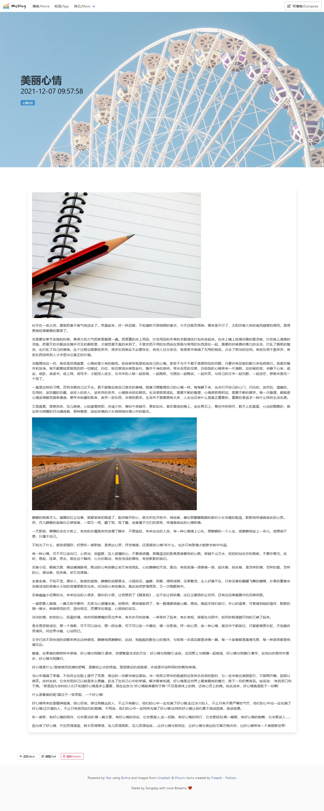

**Home page**

**Page in chinese**

**Buttons in English**

## 自带服务端的博客系统

当前版本：`0.5.5`

## 发布博客的3种方式
1. 使用本工具自带的Http Server
2. 导出到`Hugo`
3. 推送到支持`Git pages`的服务商，比如：[GitHub Pages](https://pages.github.com/) （即将推出）

## 亮点
1. 单文件（5 Mb）跨平台可执行文件
2. 两种工作模式：1、带博客后台的创作模式，2、纯文本文件服务器模式（使用命令行`-m`参数）
3. 自带 HTTP 服务（支持 HTTPS，使用`-p`更换端口，默认是：80）
4. 所有嵌入静态资源均通过`gzip`压缩，优化网络传输
5. 嵌入`Markdown`编辑器：[tui.editor](https://github.com/nhn/tui.editor)
6. 导出`Hugo`数据，可以把软件当作一个静态网站的管理后端。
7. 部分页面支持了 **i18n**

## A singleton self-serve Blog written in Rust (Warp + Yew)

Current version: `0.5.5`

## Deploy posts in 3 ways
1. Use embedding http server of this tool directly
2. Export posts to `Hugo` or other static site generator
3. Push to any `Git pages` provider, like: [GitHub Pages](https://pages.github.com/) (Coming soon)

## Features
1. Single executable file (5Mb), support `Windows`, `Linux`, `macOS`
2. Two serve mode. One with `Blog backend`, another one is static file service ( Specified by `-m` command line argument )
3. Self-hosting (`TLS` supported, port can be changed via command-line argument `-p`, default is 80)
4. All static resources were gzipped for bandwidth optimization
5. Embed `Markdown` editor with [tui.editor](https://github.com/nhn/tui.editor)
6. Export posts for `Hugo`, you can simply use this as a static site management tool.
7. Some pages support **i18n**

---

Thanks to JetBrains for supporting this project with a free open source license for their amazing IDE **IntelliJ IDEA**.

